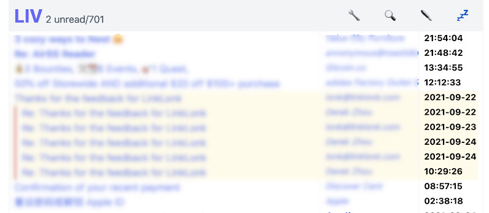

# LIV - Live Inbox View

LIV is a webmail front-end for your personal email server.

## Why LIV

All open source webmail sucks. Most I have seen are layered on top of IMAP, and IMAP sucks. The reason is you have to have search capability to deal with the high volume of emails nowadays, and it is very hard to do that across IMAP. On the other hand, some other email clients don't suck:

* Commercial "free" email providers, such as Gmail or Outlook.com don't suck. However, they are basically ads delivery vehicles targeted to you with all the privacy leaks and annoyances that you want to break out from.
* Terminal email clients (mutt, mu4e, etc) don't suck. This is what I use before LIV. However, I need to view HTML mails in a browser window and click some links and it is not convenient for those occasions.

LIV is a highly opinionated, minimal implemented webmail front-end that:

* Has a integrated search engine thanks to [mu](https://github.com/djcb/mu)
* Use browser native functionalities such as bookmarks. You can bookmark any queries or any emails
* Let you compose your emails in markdown with instant preview 

LIV is designed to be self hosted; It is not a SaaS. You run LIV on your own email server with or without an IMAP server. If you don't want to run your own email server please stop right here. If you don't know how to run your email server please do some research first; there are many excellent tutorials out there and this page is not one of them.

Although LIV is designed to run on your own email server, it can run without one running on the same machine. The experience may not be as good though. There are preliminary POP3 support (SSL on port 995 only) to get your emails, and non-local SMTP support (STARTTLS on port 587 only) to send your emails. Also, you could send emails through [Sendgrid](https://sendgrid.com/). You will also need to setup Maildir on the machine yourself:

```
$ mkdir ~/Maildir
$ cd ~/Maildir
$ mkdir .Archive cur new tmp
$ cd .Archive
$mkdir cur new tmp
```

A few screenshots below:




## Your personal webmail

LIV is designed for personal usage instead of organisational usage. It works best on your own email server on your own VPS and your own domain name, serving yourself and maybe a few family members and close friends. To do that, you need to have the following setup:

* An internet facing VPS with a valid domain name and MX records
* A working SMTP server. I recommend [exim](https://exim.org/) but others should work. It should have a open relay listening at localhost at port 25.
* The emails are delivered to system users and are stored in [Maildir](https://cr.yp.to/proto/maildir.html) format. 

You don't have to have a IMAP server but it may be useful. If you use a IMAP server, you need to disable the automatic moving from `new/` to `cur/` directory by the IMAP server. This is because LIV need to be notified by email arrival and update the index. LIV will do the moving itself. If you are using `exim` and `dovecot` like me, you will need to make sure the exim's config has:
```
LOCAL_DELIVERY = maildir_home
```
instead of:
```
LOCAL_DELIVERY = dovecot_delivery
```

Also please turn off the auto movement of new mails in your IMAP server. In dovecot, it is controlled in `/etc/dovecot/conf.d/10-mail.conf` with a line as:

```
maildir_empty_new = no
```

I understand that running your own email server is a tall task and uphill battle with email deliverability. LIV can also run without one, by getting your emails with POP3 and sending your emails with authenticated SMTP or a Sendgrid account. It can even run on your home computer.

Once you have a working email setup and you verified you can receive and send email via terminal tools such as mutt you can proceed to the next section.

## Installing LIV and its prerequisites

LIV is written in [Elixir](https://elixir-lang.org) so you need to install the tool chains for Erlang and Elixir. You will also need the basic tool chain for node.js to build the js and css. The Phoenix's [installation guide](https://hexdocs.pm/phoenix/installation.html) contains everything you need. LIV does not use a database, so the part of PostgreSQL is irrelevant. 

LIV also need a couple of commandline tools to function. They are:

* inotify-tools, to watch the new mail dir
* socat, for local machine automation

They can be installed in most Linux distributions.

LIV uses the [mu email search engine](https://github.com/djcb/mu) so you will also need to install that. Please install the 1.6.x branch. Once installed please verify that mu is indeed working by building the index `mu init && mu index`

Now you are ready to install LIV itself. LIV is a standard [Phoenix LiveView](https://www.phoenixframework.org/) web application, so just clone it from here and do:
```
mix deps.get
mix compile
npm install --prefix ./assets
mix phx.server
```

And LIV is up (port 4000). To run it in production you will need to do a standard OTP release:
```
export MIX_ENV=prod
mix compile
npm run deploy --prefix ./assets
mix phx.digest
mix release 
```

## Deploying LIV

It is critically important to run LIV over https. **Do not run LIV over plain http except in debug situation**. Also, **Each user has to run their own LIV instance**, however, all users can share the same OTP release, the same reverse proxy and the SSL cert. LIV is smart enough not to step on each others tow and to deduce the username and per-user configuration at the run time. 

Please set a few environment variables before running the release:

```
export SECRET_KEY_BASE=YOUR_SECRET_KEY_BASE
export GUARDIAN_KEY=YOUR_GUARDIAN_KEY
export PORT=4001
export MAIL_HOST=YOUR_MAIL_SERVER
_build/prod/rel/liv/bin/liv start
```

The `SECRET_KEY_BASE` and `GUARDIAN_KEY` are two random string you should generate yourself once, and keep them secret. Each user must pick a different port.

The entry point of is at: `https://YOUR_MAIL_SERVER/YOUR_USER_NAME`. Your reverse proxy needs to provide 2 proxy paths for each instance, one for regular route and one for websocket, as in the following Nginx example:

```
        location /derek {
                 proxy_set_header Host $host;
                 proxy_set_header X-Real-IP $remote_addr;
                 proxy_set_header X-Forwarded-For $proxy_add_x_forwarded_for;
                 proxy_set_header X-Forwarded-Proto  $scheme;
                 proxy_set_header X-Forwarded-Host  $host;
                 proxy_set_header X-Forwarded-Port  $server_port;
                 proxy_pass http://localhost:4001/;
                 proxy_redirect off;
        }

        location /derek/live {
                 proxy_http_version 1.1;
                 proxy_set_header Upgrade $http_upgrade;
                 proxy_set_header Connection "upgrade";
                 proxy_set_header Host $host;
                 proxy_set_header X-Real-IP $remote_addr;
                 proxy_set_header X-Forwarded-For $proxy_add_x_forwarded_for;
                 proxy_set_header X-Forwarded-Proto  $scheme;
                 proxy_set_header X-Forwarded-Host  $host;
                 proxy_set_header X-Forwarded-Port  $server_port;
                 proxy_pass http://localhost:4001/live;
                 # raise the proxy timeout for the websocket
                 proxy_read_timeout 6000s;
        }
```

You would need to substitude `derek` with your usernames of course. Each user need a pair of stanzas like above.

## Using LIV

The first time you run LIV it will ask you to setup a password. This password is not your system password, which LIV has no access to anyway. Just pick any password you like. LIV will store the hash of this password in `~/.config/self_configer/liv.config` so should you lose the password you can edit it out and restart LIV. There are a few configuration you should enter at the config screen of the application:

* Your name and preferred email address. This is the default `From:` address and `Bcc:` address
* All your email addresses, incliding the preferred one. LIV will remove them from the `Cc:` so you only receive one copy of an email
* The email lists that you belong to. LIV will remove yourself from the `Bcc:` if you are replying to a mailing list.

The query syntax is from `mu`, so you should familiar yourself with `man mu-query`

If you want to run `mu4e` at the same time with LIV, you must configure `mu4e` to use the alternative `mu` binary. A simple wrapper script is provided [here (mc)](https://github.com/derek-zhou/maildir_commander/blob/main/scripts/mc). Please note `mc` is an incomplete wrapper of `mu`; it only does enough to mimic `mu server`, to satisfy `mu4e`.

LIV has a fairly spartan user interface. You can search your email database, go though your emails one by one, write or reply email, and that's it. You won't find the following functionalities:

* Sort mails in another way. They are always sorted by date starting from the latest and they are always threaded.
* Delete mails. I don't delete emails by hand, but instead I archive emails. More on it later

On the other hand, LIV is unique in that:

* Every query, every message etc. are all bookmark-able.
* All messages are threaded, usable even on a very narrow phone screen.
* You write your emails in markdown, with instant html preview.
* Automatically download or upload attachments in the bakground, at the same time when you write or read emails. 

LIV is not designed to cover 100% of the usercases. Although I use LIV 99% of the time, I still use terminal email clients (mu4e and mutt are both fine) for corners cases such as lloking at the raw message, or handling patches.

### Using LIV to handle mailto: links

It is also possible to use LIV to handle mailto: links. All you need to do is to configure your browser to point the mailto: links to the following URL:

```
https://YOUR_MAIL_HOST/YOUR_USER_NAME/write/THE_ADDR_OR_MAILTO_LINK
```

for how to do it in Firefox, see the following article:

https://support.mozilla.org/en-US/questions/1281202

### How do I delete a mail?

No, you can't manually delete emails, nor can you edit received emails, move mails around, etc. Emails are immutable and can only expire (default 30 days), unless it qualifies to be archived (See below).

### How do I reply to a mail?

Just click on the sender's address. In fact, any email addresses within the headers of the message, including yourself, are clickable. LIV is smart enough to quote the text and prepare a default set of recipients. The address you clicked will be in the `To:` list, anybody else will be in the `Cc:` list, and yourself will be in the `Bcc:` list. There is no seperate `reply all` functionality. You can change the recipients however you like of course.

### How do I forward a mail?

No, you can't forward a mail like what you normally do in other email clients. Most other email clients munge the message to be forwarded, so it is not a strict forward anyway. You can reply to the message, adding the new recipients as needed. For the rare occation that I really need to forword a mail in verbitim I use mutt's bounce function.

## Email archiving

This is something I come up with over the years dealing with huge amount of emails in a lazy mindset. I only have two email folders, the standard inbox, and `.Archive` (The name is a convention from many IMAP clients including Thunderbird). All mails land in the inbox initially. Every once in a while LIV go through all emails in the inbox conversation by conversation. For each conversation:

* If the latest email of the conversation is within 30 days, or any mail is still unread, don't do anything with the conversation. Otherwise:
* If I (as defined my all my known email addresses) was _not_ involved in the conversation, the whole conversation is deleted.
* If I was involved in the conversation, the whole conversation is moved to the `.Archive` folder for long term storage, with all attachments removed. 

The process works best if you actively reply to important emails. It is a good online curtesy anyway. If for some reason you don't want to reply to the sender but still want to archive the conversation, you can reply to yourself and add a note. You only need to reply once for each conversation.

The marking of conversations to be archived is done as soon as possible. The marked conversation will be archived once the latest email of the conversation moves out of the 30 days retention window. Every email in a marked conversation have the `replied` flag set and will be displayed with a highlighted background. You can also search for `flag:replied` messages. 

Archived emails are still searchable, just not in the inbox so my inbox stays in constant size. If the archive target is left empty in the config page, archiving would be disabled, however marking and deleting will still be done. 

## Orbit integration

The folks at [Orbit](https://orbit.love) are kind enough to provide free services to anyone that has reasonably low volume of traffic. Orbit is a tool to analize activities, so you can find out who among your corespondances are actively engaged with you, and who are drifting away. You need to fill out the Orbit API key and the Orbit workspace in the configuration page. Both can be found from your Orbit profile. 

## Disclaimer

LIV is beta quality software, the implementation is incomplete and may never be. I use it everyday though. If you don't see a point of running your email server you do not need LIV. If you run your own email server and want to add webmail functionality to it, you are welcome to try it and give me feedback.
